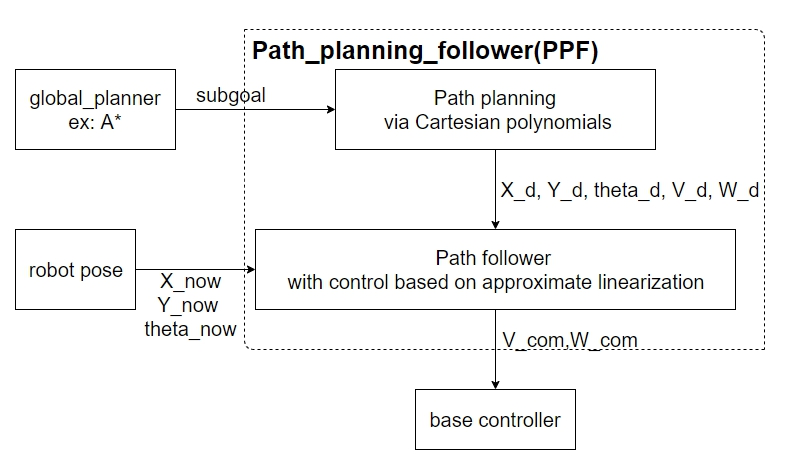

# path_planning_follower

The ROS package would creat a node to plan a path from start to goal and control mobile robot to follow the path.

Block diagram about PPF node is following:

The detail theory about path planning and control law refer to chapter 11, Robotics: Modeling, Planning and Control. B. Sicilano, L. Sciavicco, L. Villani

How to use?

1.  git clone the package into your ROS workspace/src
2.  cd path_planning_follower/src
3.  chmod +x PPY.py   //this make the PPY.py be excutable
4.  go back to you workspace, the catkin_make.

Topic:

Subscribe:

"/robot_pose" (nav_msgs.msg/Odometry)

"/subgoal_position" (geometry_msgs/Twist)

  with 
  linear.x = P1.x
  linear.y = P1.y
  linear.z = P2.x
  angular.x = P2.y
  angular.y = P3.x
  angular.z = P3.y

Publish:

"/cmd_vel" (geometry_msgs/Twist)

with
linear.x = V (linear velocity)
angular.z = W (angular velocity)
